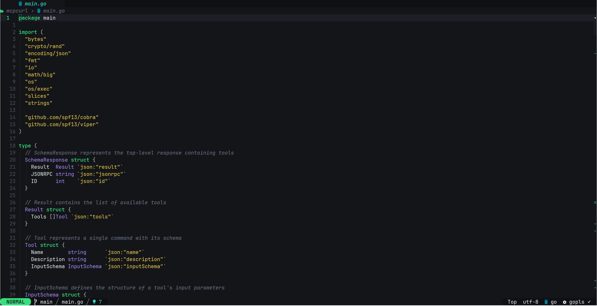
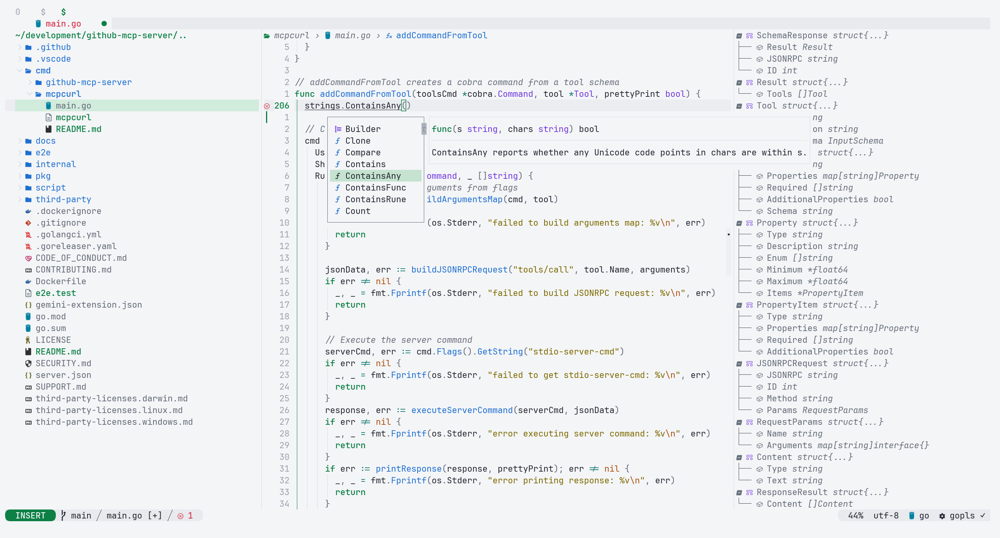

# 🌿 zero.nvim



A flat, high-contrast Neovim colorscheme with green as its signature color.
Dual dark/light modes, full Treesitter support, and coverage for 25+ popular plugins.

## ✨ Design

- 🪟 **Flat** — solid colors only, no gradients or decorative bold/italic
- 🔆 **High contrast** — WCAG 4.5:1+ for normal text, 3:1+ for UI elements
- 🌿 **Green signature** — keywords, cursor, selections, and UI chrome all anchored in green
- 🎯 **Tight palette** — 7 hue families (green · gold · blue · violet · orange · teal · red)
- 🌓 **Dual mode** — dark and light share the same role assignments; only HEX values differ

## Preview

| Light | Dark |
| ----- | ---- |
|  |  |

---

## 📦 Installation

### lazy.nvim

```lua
{
  "czrd/zero.nvim",
  priority = 1000,
  config = function()
    require("zero").setup({
      -- options (all optional)
    })
    vim.cmd("colorscheme zero")
  end,
}
```

### ⚡ No setup (minimal)

```lua
vim.cmd("colorscheme zero")
```

---

## ⚙️ Configuration

```lua
require("zero").setup({
  -- 'light' or 'dark' to force a mode; 'auto' follows vim.o.background
  style = "light",

  -- Remove all background colors (terminal transparency)
  transparent = false,

  -- Remove backgrounds only from sidebar-style windows (NvimTree, Aerial, etc.)
  transparent_sidebar = false,

  -- Soften accent and terminal colors to a pastel tone
  pastel = false,

  -- Dim inactive windows slightly
  dim_inactive = false,

  -- Set vim.g.terminal_color_0..15
  terminal_colors = true,

  styles = {
    comments  = { italic = true },   -- style table passed to nvim_set_hl
    keywords  = { bold = true },
    functions = {},
    variables = {},
    booleans  = {},
  },

  plugins = {
    all  = false,  -- load all plugin groups unconditionally
    auto = true,   -- load a plugin group when its package is in package.loaded
  },

  -- Mutate the raw palette before highlights are computed
  on_palette = function(palette)
    -- palette.green = "#00ff88"
  end,

  -- Mutate the final highlight table before it is applied
  on_highlights = function(highlights, palette)
    -- highlights.Comment = { fg = palette.comment, italic = false }
  end,
})
```

---

## 🌓 Dark / Light switching

The default is **`"light"`**. Pass `style` to `setup` to override:

```lua
-- light (default)
require("zero").setup({ style = "light" })
vim.cmd("colorscheme zero")

-- dark
require("zero").setup({ style = "dark" })
vim.cmd("colorscheme zero")
```

**Auto mode** — follows `vim.o.background` and reloads on change:

```lua
require("zero").setup({ style = "auto" })
vim.cmd("colorscheme zero")
```

```vim
:set background=dark
:set background=light
```

---

## 🎨 Color Palette

| Role                   | Key             | ☀️ Light  | &nbsp;                                        | 🌑 Dark   | &nbsp;                                        |
| ---------------------- | --------------- | --------- | --------------------------------------------- | --------- | --------------------------------------------- |
| Background             | `bg`            | `#f4f5f7` |  | `#141519` |  |
| Background dark        | `bg_dark`       | `#e8eaee` |  | `#0f1013` |  |
| Background float       | `bg_float`      | `#fbfcfd` |  | `#1c1d24` |  |
| CursorLine             | `bg_cursorline` | `#ebedf1` |  | `#1d1e26` |  |
| Visual                 | `bg_visual`     | `#c5e3d0` |  | `#2e3b33` |  |
| Foreground             | `fg`            | `#242731` |  | `#eef0f4` |  |
| Foreground dim         | `fg_dim`        | `#636b78` |  | `#b8bcc6` |  |
| Gutter                 | `fg_gutter`     | `#9ba2ad` |  | `#4b5160` |  |
| Comment                | `comment`       | `#68707c` |  | `#6e7689` |  |
| 🌿 **Green** (keyword) | `green`         | `#0c8045` |  | `#36e07e` |  |
| 🟡 Gold (string)       | `gold`          | `#7d6a00` |  | `#f2d24c` |  |
| 🔵 Blue (function)     | `blue`          | `#1d6fd0` |  | `#4ea6ff` |  |
| 🟣 Violet (type)       | `violet`        | `#7138df` |  | `#a98cff` |  |
| 🟠 Orange (constant)   | `orange`        | `#ad520f` |  | `#ff9356` |  |
| 🩵 Teal (operator)     | `teal`          | `#0b766c` |  | `#2fd9c8` |  |
| 🔴 Red (error)         | `red`           | `#d61f3a` |  | `#ff5c5c` |  |

---

## 🎨 Accessing the palette from Lua

Use `get_palette()` to retrieve the resolved color table — useful for
building integrations with other plugins (statuslines, custom highlights, etc.).

```lua
-- follows the style set in setup() (or vim.o.background when style = "auto")
local p = require("zero").get_palette()

-- force a specific mode regardless of setup()
local dark  = require("zero").get_palette({ style = "dark" })
local light = require("zero").get_palette({ style = "light" })
```

The returned table contains all palette keys:

```lua
p.green    -- #36e07e (dark) / #0c8045 (light)
p.blue     -- #4ea6ff / #1d6fd0
p.violet   -- #a98cff / #7138df
p.gold     -- #f2d24c / #7d6a00
p.orange   -- #ff9356 / #ad520f
p.teal     -- #2fd9c8 / #0b766c
p.red      -- #ff5c5c / #d61f3a
p.bg       -- background
p.fg       -- foreground
-- ... (all keys listed in the Color Palette table above)
```

**Example — custom highlight using palette colors:**

```lua
local p = require("zero").get_palette()
vim.api.nvim_set_hl(0, "MyCustomHL", { fg = p.green, bg = p.bg_float })
```

---

## 📊 lualine theme

### String (simple)

```lua
require("lualine").setup({
  options = { theme = "zero" },
})
```

### Lua utility (programmatic)

`require("zero.utils.lualine")` returns the theme table built from the current palette,
letting you inspect or modify it before passing it to lualine.

```lua
require("zero").setup({ style = "dark" })

local zero_lualine = require("zero.utils.lualine")
require("lualine").setup({
  options = { theme = zero_lualine },
})
```

You can override individual sections before passing the table:

```lua
local theme = require("zero.utils.lualine")
theme.normal.a.bg = require("zero").get_palette().teal
require("lualine").setup({ options = { theme = theme } })
```

---

## 🔌 Supported plugins

| Plugin                                                                                                                                                   | Notes                                                               |
| -------------------------------------------------------------------------------------------------------------------------------------------------------- | ------------------------------------------------------------------- |
| [nvim-treesitter](https://github.com/nvim-treesitter/nvim-treesitter)                                                                                    | Full `@capture` coverage                                            |
| [LSP Diagnostics / semantic tokens](https://github.com/neovim/neovim)                                                                                    | Underlines + virtual text, no bg on virtual                         |
| [telescope.nvim](https://github.com/nvim-telescope/telescope.nvim)                                                                                       | 3-pane border hierarchy                                             |
| [nvim-tree.lua](https://github.com/nvim-tree/nvim-tree.lua)                                                                                              | Sidebar bg, git signs                                               |
| [neo-tree.nvim](https://github.com/nvim-neo-tree/neo-tree.nvim)                                                                                          | Sidebar bg, git signs                                               |
| [lualine.nvim](https://github.com/nvim-lualine/lualine.nvim)                                                                                             | Dedicated theme file                                                |
| [bufferline.nvim](https://github.com/akinsho/bufferline.nvim)                                                                                            | Green accent on selected tab                                        |
| [gitsigns.nvim](https://github.com/lewis6991/gitsigns.nvim)                                                                                              | add/change/delete signs + line bg                                   |
| [mini.nvim](https://github.com/echasnovski/mini.nvim)                                                                                                    | statusline, tabline, files, diff, indentscope, icons, pick, clue, … |
| [indent-blankline.nvim](https://github.com/lukas-reineke/indent-blankline.nvim) v3                                                                       | scope = green                                                       |
| [nvim-cmp](https://github.com/hrsh7th/nvim-cmp)                                                                                                          | Kind icons mapped to palette                                        |
| [blink.cmp](https://github.com/Saghen/blink.cmp)                                                                                                         | Kind icons mapped to palette                                        |
| [which-key.nvim](https://github.com/folke/which-key.nvim)                                                                                                | v2 + v3                                                             |
| [alpha-nvim](https://github.com/goolord/alpha-nvim) / [dashboard-nvim](https://github.com/nvimdev/dashboard-nvim)                                        | Header = green                                                      |
| [nvim-notify](https://github.com/rcarriga/nvim-notify)                                                                                                   | Per-level colors                                                    |
| [noice.nvim](https://github.com/folke/noice.nvim)                                                                                                        | Cmdline popup, lsp progress                                         |
| [flash.nvim](https://github.com/folke/flash.nvim)                                                                                                        | Label = green bg                                                    |
| [trouble.nvim](https://github.com/folke/trouble.nvim)                                                                                                    | v2 + v3                                                             |
| [todo-comments.nvim](https://github.com/folke/todo-comments.nvim)                                                                                        | All keyword tags                                                    |
| [nvim-dap](https://github.com/mfussenegger/nvim-dap) / [nvim-dap-ui](https://github.com/rcarriga/nvim-dap-ui)                                            | Breakpoint = red, stopped line = gold                               |
| [mason.nvim](https://github.com/williamboman/mason.nvim)                                                                                                 |                                                                     |
| [lazy.nvim](https://github.com/folke/lazy.nvim)                                                                                                          | Plugin manager UI                                                   |
| [render-markdown.nvim](https://github.com/MeanderingProgrammer/render-markdown.nvim) / [headlines.nvim](https://github.com/lukas-reineke/headlines.nvim) | Headings = green                                                    |
| [diffview.nvim](https://github.com/sindrets/diffview.nvim)                                                                                               | File panel, diff regions                                            |
| [aerial.nvim](https://github.com/stevearc/aerial.nvim)                                                                                                   | Symbol sidebar                                                      |
| [nvim-navic](https://github.com/SmiteshP/nvim-navic) / [barbecue.nvim](https://github.com/utilyre/barbecue.nvim)                                         | Breadcrumb                                                          |

---

## 💻 Terminal emulator themes

Dark and light theme files are provided for the most common terminal emulators under [`extras/`](extras/).

| Terminal                                    | Files                                              | Setup guide                                                            |
| ------------------------------------------- | -------------------------------------------------- | ---------------------------------------------------------------------- |
| [Alacritty](https://alacritty.org)          | `zero-dark.toml` / `zero-light.toml`               | [extras/alacritty/README.md](extras/alacritty/README.md)               |
| [foot](https://codeberg.org/dnkl/foot)      | `zero-dark.ini` / `zero-light.ini`                 | [extras/foot/README.md](extras/foot/README.md)                         |
| [Ghostty](https://ghostty.org)              | `zero-dark` / `zero-light`                         | [extras/ghostty/README.md](extras/ghostty/README.md)                   |
| [iTerm2](https://iterm2.com)                | `zero-dark.itermcolors` / `zero-light.itermcolors` | [extras/iterm/README.md](extras/iterm/README.md)                       |
| [Kitty](https://sw.kovidgoyal.net/kitty)    | `zero-dark.conf` / `zero-light.conf`               | [extras/kitty/README.md](extras/kitty/README.md)                       |
| [WezTerm](https://wezfurlong.org/wezterm)   | `zero-dark.toml` / `zero-light.toml`               | [extras/wezterm/README.md](extras/wezterm/README.md)                   |
| [Windows Terminal](https://aka.ms/terminal) | `zero-dark.json` / `zero-light.json`               | [extras/windows_terminal/README.md](extras/windows_terminal/README.md) |
